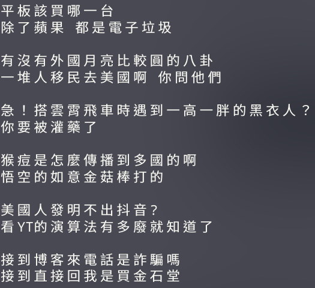
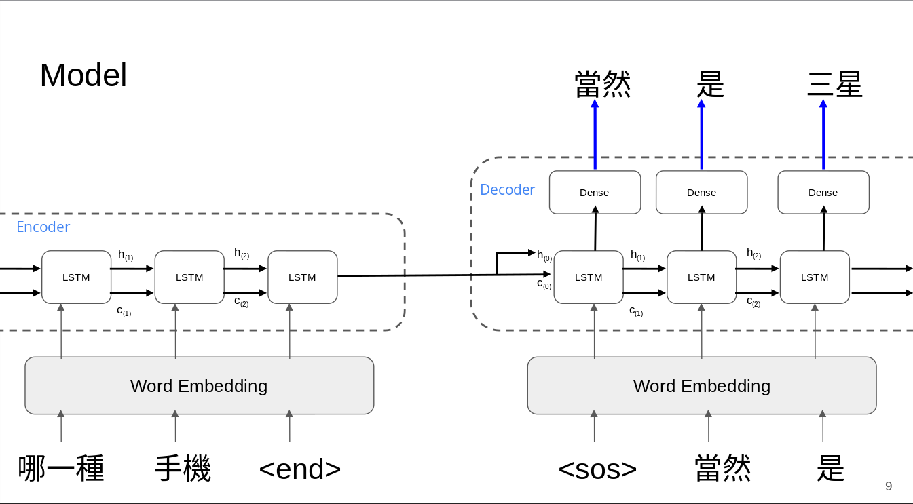

# 仿 PTT 鄉民問答 Bot

國立暨南國際大學 1102 自然語言處理 Final Project

- 組員
    - 108321030 劉承熙
    - 108321032 王廷郡

## 動機
- 因為平常喜歡看 PTT 的鄉民梗，雖然有時候 PTT 鄉民發言時常政治不正確，但是有些用語很有趣而且很特別，算是一種次文化

## 資料來源
- 參考 [zake7749/Gossiping-Chinese-Corpus](https://github.com/zake7749/Gossiping-Chinese-Corpus) repo 自行撰寫爬蟲程式，爬取八卦板中分類為 ”[問卦]” 的「標題」及「推文」， 2022-02-01 ~ 2022-05-28 共計 108900 篇文章
- 參考 Gossiping-Chinese-Corpus repo 以推文中詞出現的數量進行各推文的分數加權，取最高者當作 Answer
- 資料範例如下圖
    - 

## 觀察 - 疫情時代下 PTT 八卦板常用詞

## Model
- 使用 PyTorch 框架，使用 LSTM layer 實做基本 Seq2seq model
    - 

## 實做成果
- 許多對話 model 仍然無法正常回覆，以下為經挑選過的結果

